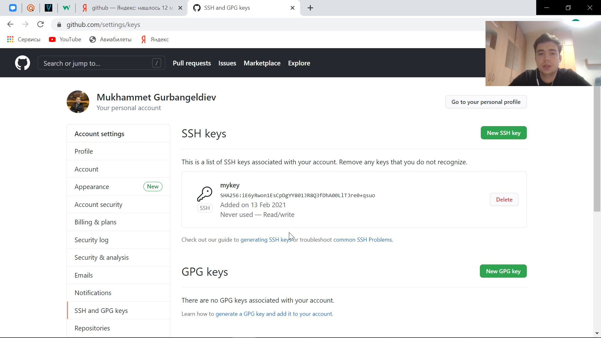
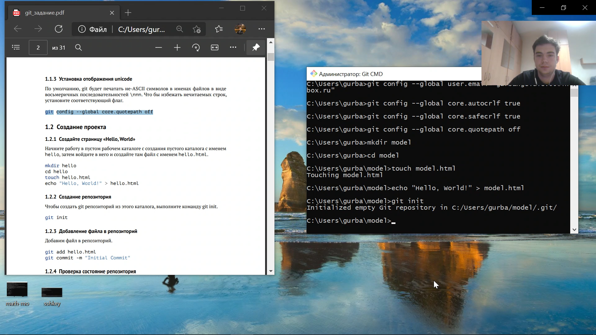
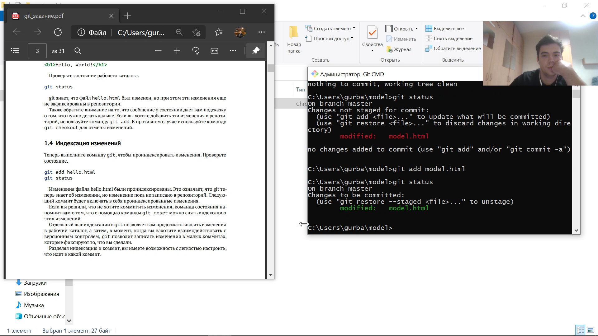
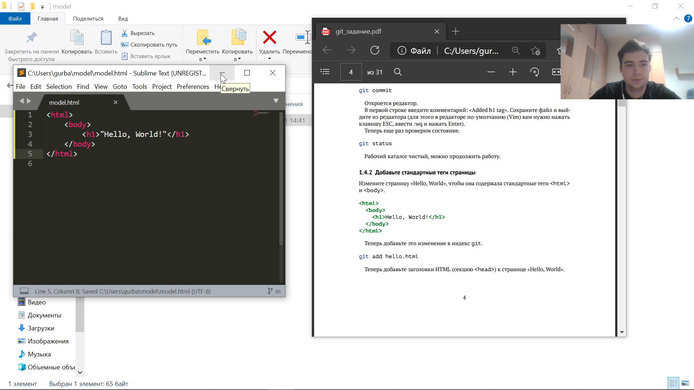
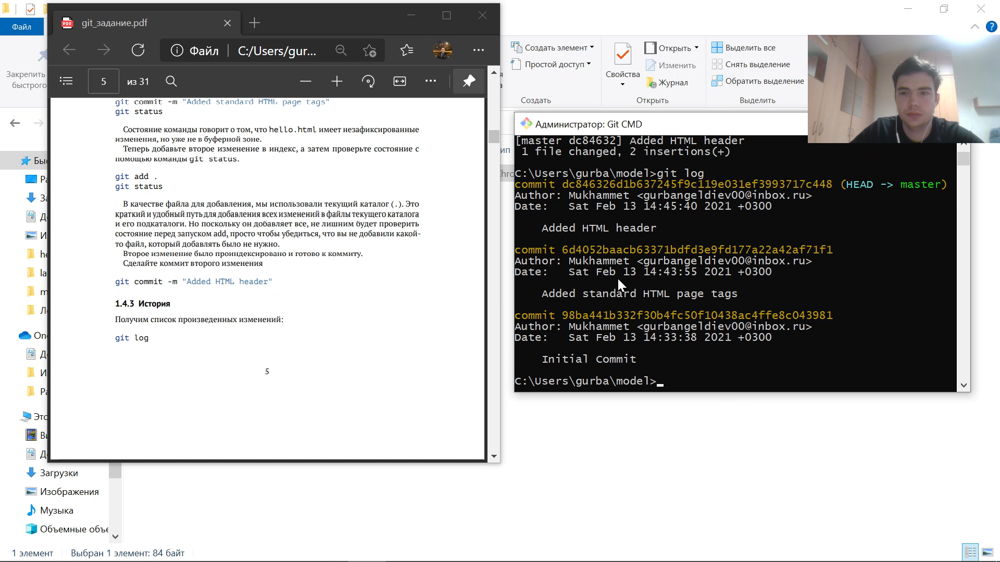
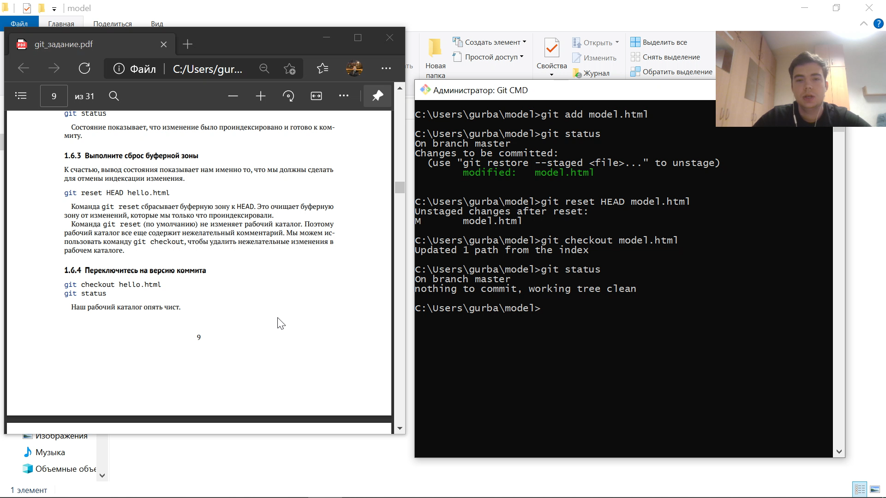
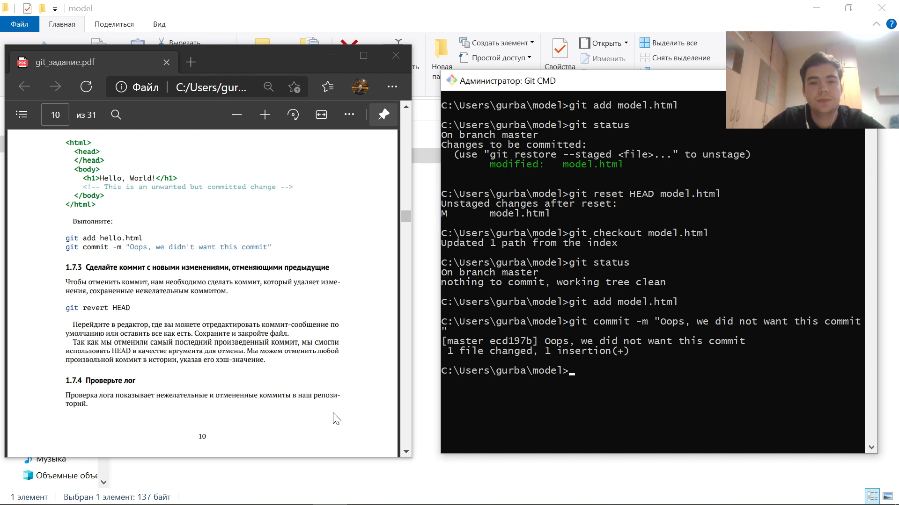

---
# Front matter
lang: ru-RU
title: "Отчет по лабораторной работе 1"

author: "Гурбангельдиев М.Г. НФИ-03-18"

# Formatting
toc-title: "Содержание"
toc: true # Table of contents
toc_depth: 2
lof: true # List of figures
lot: true # List of tables
fontsize: 12pt
linestretch: 1.5
papersize: a4paper
documentclass: scrreprt
polyglossia-lang: russian
polyglossia-otherlangs: english
mainfont: PT Serif
romanfont: PT Serif
sansfont: PT Sans
monofont: PT Mono
mainfontoptions: Ligatures=TeX
romanfontoptions: Ligatures=TeX
sansfontoptions: Ligatures=TeX,Scale=MatchLowercase
monofontoptions: Scale=MatchLowercase
indent: true
pdf-engine: lualatex
header-includes:
  - \linepenalty=10 # the penalty added to the badness of each line within a paragraph (no associated penalty node) Increasing the value makes tex try to have fewer lines in the paragraph.
  - \interlinepenalty=0 # value of the penalty (node) added after each line of a paragraph.
  - \hyphenpenalty=50 # the penalty for line breaking at an automatically inserted hyphen
  - \exhyphenpenalty=50 # the penalty for line breaking at an explicit hyphen
  - \binoppenalty=700 # the penalty for breaking a line at a binary operator
  - \relpenalty=500 # the penalty for breaking a line at a relation
  - \clubpenalty=150 # extra penalty for breaking after first line of a paragraph
  - \widowpenalty=150 # extra penalty for breaking before last line of a paragraph
  - \displaywidowpenalty=50 # extra penalty for breaking before last line before a display math
  - \brokenpenalty=100 # extra penalty for page breaking after a hyphenated line
  - \predisplaypenalty=10000 # penalty for breaking before a display
  - \postdisplaypenalty=0 # penalty for breaking after a display
  - \floatingpenalty = 20000 # penalty for splitting an insertion (can only be split footnote in standard LaTeX)
  - \raggedbottom # or \flushbottom
  - \usepackage{float} # keep figures where there are in the text
  - \floatplacement{figure}{H} # keep figures where there are in the text
---

# Цель работы

 Подготовить отчёт по лабораторной работе, а также познакомиться
с основными возможностями разметки Markdown.

# Задание

1. Онакомиться с основными командами git
2. Выполнить отчёт в виде markdown

# Выполнение лабораторной работы

## Знакомство с git 

### Теоретические сведения
Git — одна из распределенных систем контроля версий.

GitHub — один из сервисов для использования системы контроля версий Git.

repository — некоторое хранилище файлов, ссылок на изменения в файлах
commit — отслеживание изменений, сохраняет разницу в изменениях
HEAD — (специальный указатель) символическая ссылка на последние изменения. Примечание: Не обязательно ссылается на commit. Может указывать на ветвь. Состояние — «Detached HEAD»
HEAD используется репозиторием для определения того, что выбрано с помощью checkout.
Обратите внимание на это различие: «head» (в нижнем регистре) относится к любому из названных заголовков в хранилище; «HEAD» (верхний регистр) относится исключительно к текущему активному заголовку(ссылке). Это различие часто используется в документации Git. HEAD может указывать на именованную вершину какой-либо ветки или на commit.
Объекты Git. Четыре типа объектов: Blob, Tree, Commit и References.
Ветвь определяется не в самом Git, а наследуется от операционной и файловой систем.
Более подробно об объектах Git вы можете прочитать в документации.

git сервисы — сервисы предоставляющие услуги для пользователей git.

Основные команды:

-git init

-git add

-git status

-git commit

-git clone

### Выполнение работы 

1) Создание аккаунта на github.com
Аккаунт был ранее создан в рамках прошлых курсов.

2) Сгенерировал ssh ключ и разместил его.

3)Чтобы создать git репозиторий из этого каталога, выполнил команду git init

4) Выполняем команду git чтобы проиндексировать изменения. И проверяем состояние

5) Добавляем стандартные теги страницы

6) Получаем историю произведенных изменений

7) Выполняем сброс буферной зоны

8)Изменить файл и сделать коммит

# Выводы

Я научился работать с git и разметкой markdown
